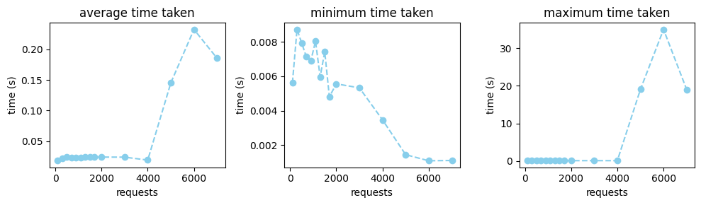

# Tiny Reverse Proxy in Rust


For this assignment, I've implemented a tiny reverse proxy (trp) in rust. The implementation is minimal and implements only the basic functionality of reverse proxy—forwarding the requests to a desired service.

## Project Structure

Everything related to the core implementation of the service is located in `src`, and things related to tests are in `tests` folder. 

### `src`

Within `src` we have a couple main modules pertaining to the project. 

#### `router`

This is responsible for creating a routing table for the paths stored in the config file. It uses `glob` to match patterns so that we can define catch-all paths.

#### `thread_pool`

This is a very simple implementation of a thread pool. It's platform agnostic, whcih allows for easier migrations; however, it's not as efficient as event loops. In the future, we could integrate `tokio` into the project to keep it platform agnostic, yet implement the event loop.

#### `utils` 

This file holds utility functions.

#### `handlers` 

This folder holds things related to handling the request on the server side. Anything from making a request to the upstream server to rewriting the request user is making happens here.

### `tests`

This folder holds all the tests for the project. 

#### `units` 

This folder holds unit tests.

#### `stress` 

This folder holds files related to stress testing. Those tests are quite simple and implemented for ease of use in python, which might also be their biggest drawback as they share resources.

## Running the project

### rust

First, you need to install [rust](https://www.rust-lang.org/tools/install). Once rust is installed you can go ahead and use `cargo` to install all dependecies.

### Installation

```sh
cd tiny-reverse-proxy-rust
cargo install --path
# For building a release version
cargo build -r
```

### Test Coverage

For test coverage, I used `tarpaulin`. To get access to the report, you can install it through cargo and create an html version of the report.

```sh
cargo install cargo-tarpaulin
cargo tarpaulin --out Html
```

### Stress Testing 

I have used the python script in `test/stress` to stress test the server. I haven't managed to fully take it down. The requests have never failed; however, the time needed to server one on average has incrased quite dramatically after 4k requests.



Using the unit tests, we have managed to cover 98% of the codebase.

## Video Tutorial

[Loom Link](https://www.loom.com/share/eadc020be9994e5094bcfc5bf0706369?sid=e308bf2b-b88c-4cb3-9e46-add122082c65)

## AI Policy

I have used chatGPT for debugging code and finding language specific syntax. I have used copilot sporadically for autocompletion.

